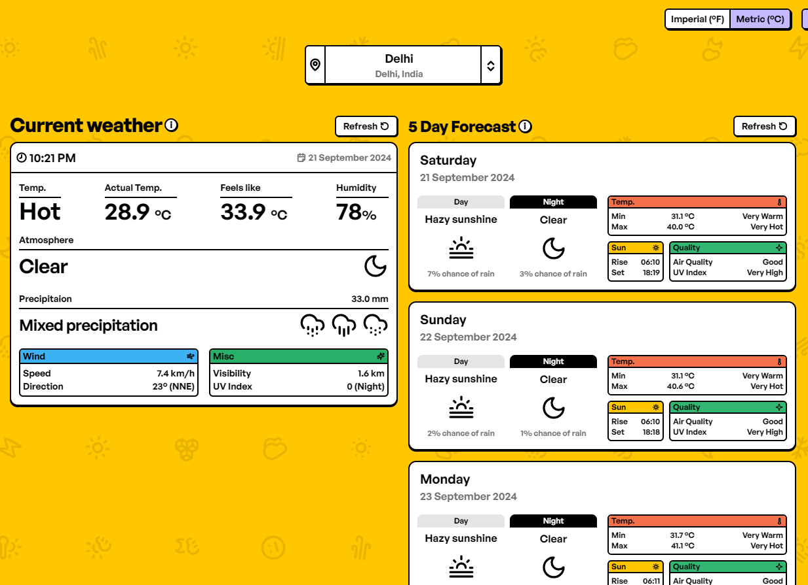

# Weather Forecast

## Overview

Assignment made for Propacity frontend engineer position.

[Visit](https://weather-forecast-delta-ten.vercel.app/)

### Tech Stack

React + Javascript + Vite + Tailwind

### Features

- Once city is selected, it becomes default city and weather data gets stored in local storage.
- Has two modes, live and demo ( when app hits api limit)
- Imperial and Metric unit conversion using context provider
- Custom local storage hook developed for this
- Service worker added which enables app to work offline
- Brutalist theme, colors inspired by figma store

### Setting it up on local

- Clone repo to local device
- "npm install" to install the required node_modules
- "npm run dev" to run the project on local
- Project will not work in live mode without .env file, contact me if you need it or try demo mode
